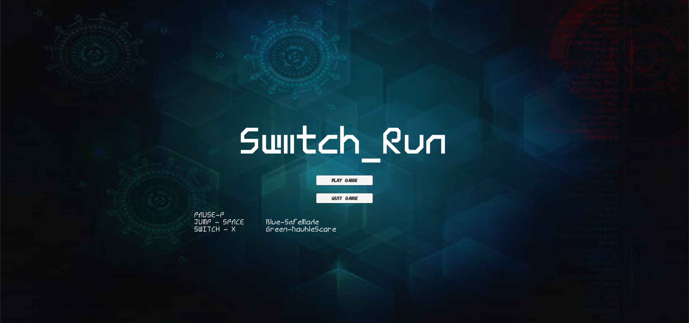
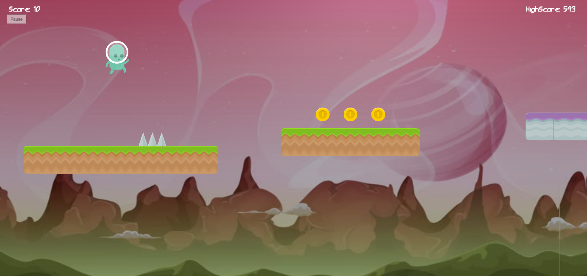
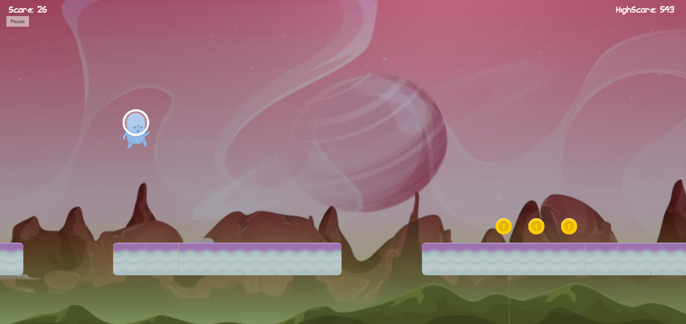

# Switch_Run

The game follows an intergalactic space explorer, Pod, whose quest for adventure has gotten him trapped in a reality rift between two dimensions. He must make use of his new found powers to get himself out of the tunnel. The game takes place in a starry inter-dimensional tunnel with various interstellar objects that the player may come in contact with.

Player controls an alien character that moves perpetually to the right. The player is tasked with getting this character to the finish line. The game setting is a 2D runner.
The game features a mechanic where the player can touch only objects that have the same colour as his character. Player has to switch his character’s colour so as to move on different platforms. He is challenged to jump over pits and obstacles.

The game will be made on the Unity3D engine. Using C# as the base language. Functions to keep count of various internal factors. Platforms are generated at random, being picked out from a pool.

Screenshot

https://av217.itch.io/switch-run

